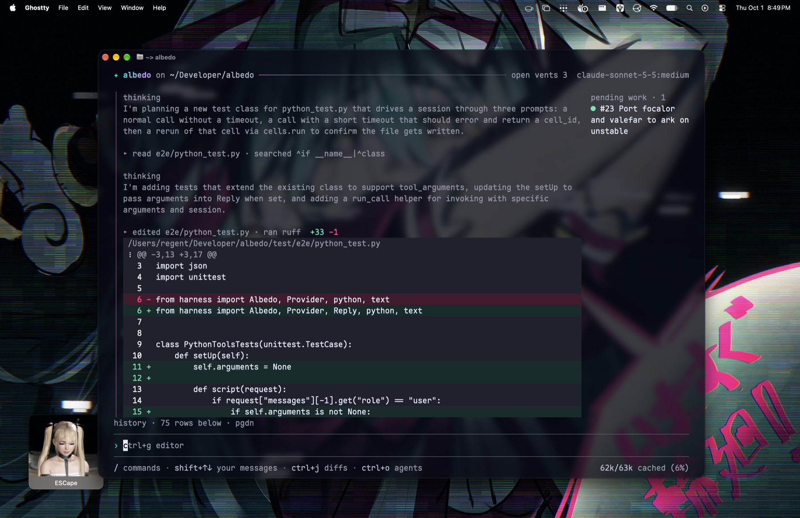

# Overview (pre-alpha)



Albedo is an agentic coding harness that can act on your device and soon able to manage sessions on other devices with agents that can act remotely on different machines or within containers. Our hope is that it being built on BEAM allows it to maintain low memory usage while running many concurrent agents and subagents across devices.

It is daemonized with the CLI and (future) WebUI being clients of this daemon. This ensures the agents can be programatically created, controlled, and even stopped all while still providing an experience similar to other harnesses like Claude Code and Codex. Albedo provides a Python REPL for the agents to use as a scratchpad and data manipulation allowing them to experiment, reason, and play with code before actually writing it down. This is similar to what other harnesses call CodeMode, and is based on [prime-agent's](https://github.com/PrimeIntellect-ai/prime-agent/)'s Python REPL and design.

The CLI is written in Go and uses the Charm stack. 

```sh
# build native go cli
go -C cli build -o bin/albedo ./cmd/albedo
./cli/bin/albedo

# or to install it globally
go -C cli install ./cmd/albedo
albedo
```

When installed globally outside the checkout, set `ALBEDO_ROOT` to the absolute repo path if the daemon needs to be started:
```sh
ALBEDO_ROOT=/path/to/albedo albedo
```
`ALBEDO_ROOT` is only needed when the installed binary needs to launch the daemon from outside the repo tree; the local binary (`./cli/bin/albedo`) discovers the repo root automatically from its file path. you can also embed the root at build/install time if preferred:
```sh
go -C cli install -ldflags "-X main.buildRoot=$(pwd)" ./cmd/albedo
```

nix package (includes the compiled daemon and python runtime):

```sh
nix build .#albedo
nix run . -- --help
# package checks, with a local mock provider (no model credentials):
python3 test/manual/nix_package_smoke.py "$PWD/result/bin/albedo"
ALBEDO_NO_BROWSER=1 ALBEDO_TEST_BINARY="$PWD/result/bin/albedo" python3 test/daemon/integration.py
```

`default.nix` is also available through `pkgs.callPackage ./default.nix { }`.
no checkout or gleam compiler is needed at runtime. `ALBEDO_DAEMON` can override
the packaged daemon with an absolute executable path. when the running daemon
is from another build, the packaged cli asks in a terminal whether to restart it,
and elsewhere keeps it and prints a warning.

optional: `view`, which lets the model see its changes and code as highlighted
images for a final review pass. needs cargo.

```sh
native/render/install.sh   # then enable `view` in /extensions
```

## CLI usage

Run `albedo` to open the terminal interface, or use `--prompt` to print a reply:

```sh
albedo -p "Explain this project"
albedo --prompt "Run the checks" --session SESSION_ID --timeout 10m
albedo resume SESSION_ID
albedo sessions --json
albedo sessions read SESSION_ID 3      # the newest 3 turns (default 1); --json for structure
albedo sessions send SESSION_ID "message"
```

Session IDs may be shortened to any unique prefix. `sessions read` ends with a
`[running]` line while the session is still working, so another agent knows to
read again; `sessions send` is the same command as `albedo send`.

Run `albedo --help` or `albedo COMMAND --help` for command options.
Unknown flags and extra arguments are errors. The root flags `--session`,
`--model`, and `--timeout` require `--prompt` and cannot accompany a subcommand.
Prompts have no time limit unless you supply a positive duration with `--timeout`.
Use `--prompt=--help` for a prompt that starts with a flag, or `--` before
positional text such as `albedo send -- SESSION_ID "--literal message"`.

To inspect disk usage without starting the daemon, run `albedo storage --json`
or `albedo storage --sessions`. To clean up local files, stop the daemon first:

```sh
albedo daemon --stop
albedo storage prune --backups
```

Cleanup shows a preview and asks for confirmation. To permanently delete sessions,
use `albedo storage prune --session SESSION_ID`, repeating `--session` for each
full ID. Add `--yes` to skip confirmation in scripts.

formatting

```sh
nix fmt                         # treefmt: Nix, Gleam, Go, Python, and shell files
pre-commit install              # once per checkout; available in `nix develop`
pre-commit run --all-files       # format, lint Python, and type-check Python
gleam format src test           # fix Gleam formatting
ruff format priv/python test    # fix Python formatting
ruff check                      # lint Python
ty check                        # type-check the kernel, plugins, and tests
```

The commit hook formats staged Gleam and Python files, checks Python lint, and
runs ty across the Python kernel and tests. Re-stage any formatting changes.
It requires `gleam` on PATH; pre-commit installs pinned Ruff and ty versions in
its own environments. Treefmt formats Python and applies Ruff lint fixes.
Nix supplies the development tools; hook versions are pinned separately.
`./test.sh` runs Ruff lint, Ruff formatting checks, and ty before the build and
test suites. Python check settings live in `pyproject.toml`.

tests

```sh
./test.sh               # gleam, native go cli, and daemon suites
go -C cli test ./...    # native go cli tests
go -C cli vet ./...     # native go cli vet
gleam test              # gleam suite plus the python harnesses that hold no build lock
```

`test/manual` contains opt-in package and provider checks. They require a
packaged binary or operator-supplied credentials and are outside the normal gate.

todo
- [] flesh out plugin system more
- [] sdk and -p, command to print out most recent assistant message from session
- [✓] compaction strategy plugins LCM and snapcompact
- [] compaction evaluations: old-fact recall, corrected instructions, tool pairing, images, restarts, and token/cost comparisons
- [✓] subagents plugin
- [] social plugins like discord
- [✓] plugins like heartbeat and skills
- [ish] oauth that we shamelessly rip from omp
- [] ai powered approve for me (jev/llm)
- [] improve verbose mode on tui
- [] webui
- [] connect to other albedos on tui/webui and manage sessions
- [ish we have remote but model opts into it, not yet able to have the model natively act in a different machine] ability to offload tools like python/bash onto other machines/containers
