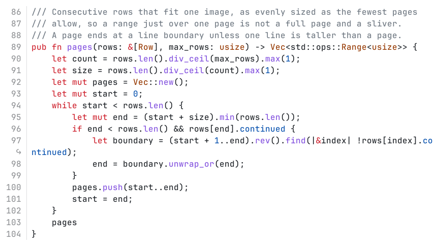

# albedo-render

Turns part of a source file into pictures of the code, with syntax colors and
line numbers, so the model can look at code the way a person does. albedo's
`view` extension runs it when the model calls `view_code` or `view_diff`.

It colors the whole file, so a range that starts inside a comment or string
still looks right. Long lines wrap at 79 columns with an arrow marking the
wrap, and long ranges are split into several images.

Install it with `./install.sh` (needs cargo), which puts the binary in
`priv/bin`.
